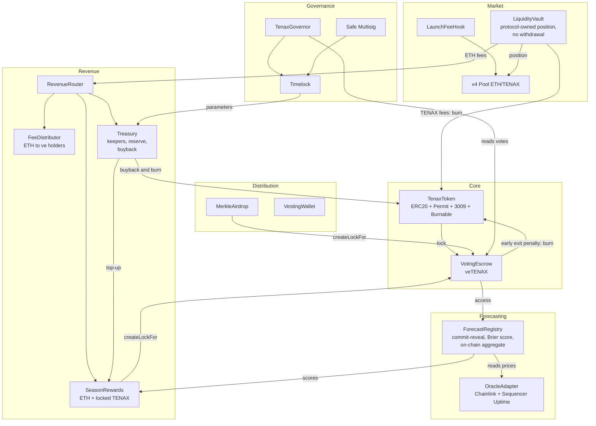

# Tenax Protocol

**A self-sustaining, fully on-chain forecasting network with protocol-owned liquidity**

Version 1.0 (draft, under review) · September 2026 · brmz

---

## Abstract

Tenax Protocol is a forecasting network that runs entirely on-chain on Base. Participants lock TENAX to obtain veTENAX, a decaying balance that carries voting power, a share of protocol revenue and the right to submit probability forecasts on asset volatility. Forecasts are committed before the outcome is known, revealed afterwards, scored with the Brier score, a strictly proper scoring rule, and combined into a reputation-weighted aggregate that any contract can read. There is no betting: no participant can lose locked principal, and rewards only go to those who demonstrate skill with statistical significance.

TENAX derives its value from scarcity. Forecasting requires locking tokens for up to two years, every emission and airdrop is delivered locked, and every sell in the protocol's pool and every early exit from a lock burns tokens. The protocol's only revenue is the trading fee of a Uniswap v4 pool whose liquidity is owned by the protocol and can never be withdrawn: fees paid in ETH are distributed to forecasters, veTENAX holders and a treasury, which pays keepers and uses the surplus to buy back and burn TENAX; fees paid in TENAX are burned. Emissions follow a schedule measured in Ethereum L1 blocks, falling steeply in the first epochs and by 15% per epoch afterwards. Every recurring task is permissionless and paid, so the protocol keeps operating without its author, without servers and without off-chain coordination.

---

## 1. Introduction

### 1.1 Motivation

A calibrated probability forecast is useful information. An estimate that BTC will move more than usual over the next 24 hours, published with a verifiable track record, is something other systems can reason about and build on.

Forecasts like these are usually produced in one of two ways. Prediction markets price outcomes through trading, which requires counterparties, custody of stakes and enough liquidity for every question. Forecasting platforms score their participants off-chain, so neither the scores nor the aggregate can be verified or consumed by smart contracts.

Tenax takes a third path. Access is gated by locked tokens instead of stakes at risk, accuracy is measured with a proper scoring rule, and the full pipeline (submission, resolution, scoring, aggregation and rewards) runs in contracts. The output is a forecast signal whose entire history is public and verifiable.

The token is designed around the same idea of durability. Many tokens pay participants through liquid emissions and rely on liquidity that the team can withdraw. Tenax inverts both: emissions are locked, and pool liquidity is permanent and owned by the protocol. Using the protocol takes tokens out of circulation, and leaving early costs burned tokens.

### 1.2 Design goals

1. **Fully on-chain.** No server, API or coordinator is required for the protocol to work.
2. **No betting, no slashing.** Nobody stakes funds against anyone else and nobody loses principal for being wrong. Locking is an access requirement, not a wager.
3. **Clean token.** Fixed supply minted once, with no transfer tax, blacklist, pause, mint function or owner.
4. **Value through scarcity.** Participation takes tokens out of circulation, and burn sources reduce supply with usage.
5. **Permanent protocol-owned liquidity.** There is no code path that withdraws the initial liquidity.
6. **Locked emissions.** Every emitted token is delivered into a lock and cannot leave before it expires.
7. **Skill, not luck.** Only participants who demonstrate statistically significant skill are rewarded.
8. **Operational self-sufficiency.** Every recurring task can be executed by anyone and is paid by the protocol.
9. **Zero creator capital.** The creator's only cost is deployment gas; their only compensation is a vested allocation.
10. **Bounded governance.** Contracts are immutable, governance can only move parameters within hard limits written in code, and it controls no funds.
11. **Transparency.** Verified contracts and public addresses, allocations and creator wallets.

### 1.3 The name

*Tenax* is Latin for "tenacious" or "holding fast". It describes both halves of the design: a token that rewards holding, and a protocol that keeps running on its own.

---

## 2. System overview

### 2.1 Participants

| Participant | Role | Incentive |
|---|---|---|
| Forecasters | Submit probability forecasts every round | ETH revenue share and locked TENAX emissions, proportional to demonstrated skill |
| Lockers | Lock TENAX for up to two years | ETH fee share, voting power, forecasting access |
| Traders | Buy and sell TENAX in the pool | Market exposure; their fees fund the protocol |
| Keepers | Execute recurring maintenance calls | Gas refund plus a margin |
| Governance | Adjusts bounded parameters | Long-term value of the protocol |

### 2.2 Architecture



| Component | Contract | Responsibility |
|---|---|---|
| Token | `TenaxToken` | Fixed-supply ERC-20 with signature approvals and transfers |
| Vote escrow | `VotingEscrow` | Locks TENAX, tracks veTENAX balances and burns early exit penalties |
| Forecasting | `ForecastRegistry` | Rounds, threshold and base rate, commit-reveal, scoring, reputation and aggregation |
| Oracle | `OracleAdapter` | Validated Chainlink prices with sequencer uptime checks |
| Launch | `LaunchFeeHook` | Restricted pool initialization, decaying launch fee and a TWAP that guards buybacks |
| Liquidity | `LiquidityVault` | Permanent owner of the pool position; collects and routes fees |
| Revenue | `RevenueRouter`, `FeeDistributor` | Splits ETH revenue; pays weekly shares to veTENAX holders |
| Rewards | `SeasonRewards`, `EmissionSchedule` | Pays forecasters with significant skill; releases emissions by L1 block |
| Distribution | `MerkleAirdrop`, `VestingWallet` | Locked airdrop; creator vesting |
| Treasury | `Treasury` | Pays keepers, releases the TENAX reserve at a fixed rate, and buys back and burns TENAX with surplus ETH |
| Governance | `TenaxGovernor`, `TimelockController` | Bounded parameter changes |

### 2.3 Value cycle

```
TENAX trading in the pool
   ├─ buys → fee in ETH → RevenueRouter
   │     ├─ 40% → forecasters with significant skill (SeasonRewards)
   │     ├─ 40% → veTENAX holders (FeeDistributor)
   │     └─ 20% → treasury → keepers; surplus buys back TENAX → burned
   └─ sells → fee in TENAX → burned

early exit from a lock → penalty of up to 50% → burned
unused reserve allowance each season → burned

forecasting and earning require locking → less circulating supply
```

---

## 3. Forecasting mechanism

### 3.1 Questions and rounds

In v1, the protocol asks about the volatility of two assets: will the absolute move of **BTC/USD** (or **ETH/USD**) over the next 24 hours **exceed the round's threshold** $X$? A forecast is a probability $p$ expressed in basis points, from 0 to 10,000.

The question is about volatility rather than direction for a statistical reason. The short-term direction of a liquid asset is close to random, so measured skill would be mostly luck. Volatility is persistent (turbulent periods tend to stay turbulent), which gives good forecasters a real, measurable edge (section 3.9).

One round opens per asset per day, about 60 per 30-day season across both assets. Rounds for the same asset never overlap, so each outcome is independent evidence.

```
|--- submission (commit) ---|------------ horizon (24 h) ------------|--- reveal ---|
t0                     t_commitEnd                              t_resolve     t_revealEnd
                       reads P_ref                              reads P_close  finalize
```

1. **Opening.** The round's threshold $X$ and base rate $b$ are fixed (section 3.2).
2. **Submission.** A participant with $\text{ve} \ge \text{minVe}$ submits a commitment. Their aggregation weight for the round is fixed at this moment.
3. **`t_commitEnd`.** Submissions close and the reference price $P_{\text{ref}}$ is recorded from the oracle.
4. **`t_resolve`.** The closing price $P_{\text{close}}$ is recorded. With $r = P_{\text{close}} / P_{\text{ref}} - 1$, the outcome is $o = 1$ if $|r| > X$, and $o = 0$ otherwise.
5. **Reveal.** Participants reveal their forecasts, which are scored and added to the aggregate.
6. **`t_revealEnd`.** The round is finalized and the aggregate is published.

Recording prices and finalizing rounds are permissionless calls paid by the protocol (section 7).

### 3.2 Threshold and base rate

A fixed threshold would not work: in a calm market almost no round would exceed it, and in a turbulent one almost every round would. Instead, each asset keeps two exponential moving averages, updated whenever a round resolves:

```math
X \leftarrow X + \beta\,(|r| - X), \qquad b \leftarrow b + \gamma\,(o - b), \qquad \beta = \tfrac{1}{30},\ \ \gamma = \tfrac{1}{365}
```

- **Threshold $X$:** tracks the typical size of 24-hour moves over the last month, so the question stays uncertain in any market regime. Each asset's initial value is computed at deployment from the last year of prices.
- **Base rate $b$:** the frequency with which the threshold was exceeded, measured by a slow average of about one year. It is the best forecast available to someone with no information beyond history. The slowness is deliberate: with a fast average, $b$ moves several points from one week to the next, and answering a constant, such as the historical average, would start to earn skill without any forecasting. The initial value is the frequency measured over the last year of prices before deployment.

Both values are copied into the round when it opens and never change afterwards, so every participant answers the same question against the same reference. $b$ is stored in basis points, the same unit as forecasts, so answering exactly $b$ is always possible. Voided rounds do not update the averages.

### 3.3 Commit-reveal

A forecast is submitted as

```math
c = \text{keccak256}(\text{roundId},\ \text{participant},\ p,\ \text{salt})
```

and revealed only after the outcome is known. Nobody can copy a forecast before the horizon ends, and nobody can change one after seeing the result. The front-end derives the salt from a wallet signature, so the data needed to reveal can always be recomputed and is never lost.

A participant could try to reveal only the forecasts that turned out well. To prevent this, a commitment that is not revealed by `t_revealEnd` is scored as the worst possible forecast ($B = 1$). The penalty is applied lazily, on the participant's next interaction or when they claim season rewards, so no loop over participants is ever needed.

### 3.4 Scoring

Let $p \in [0, 1]$ be the revealed probability and $o \in \{0, 1\}$ the outcome. The protocol uses the Brier score [1] and measures skill relative to the round's base rate:

```math
B(p, o) = (p - o)^2, \qquad S(p, o) = B(b, o) - B(p, o) = (b - o)^2 - (p - o)^2
```

Skill is the improvement over the **realized** Brier score of answering the base rate in that round. Answering $b$ scores exactly zero in every round, and positive skill means knowing more than history. Measuring against the realized score, rather than the expected score $b(1-b)$, keeps the noise in $b$ from turning into skill or penalties for someone who knows nothing. In a single round, $S \in [(b-o)^2 - 1,\ (b-o)^2]$.

**Honesty is optimal.** If the true probability of the event is $q$, the expected Brier score of a forecast $p$ is

```math
\mathbb{E}[B] = q\,(1 - p)^2 + (1 - q)\,p^2, \qquad \frac{\partial\, \mathbb{E}[B]}{\partial p} = 2\,(p - q)
```

which has a unique minimum at $p = q$. Since $b$ is fixed before submission, $B(b, o)$ does not depend on $p$: maximizing expected skill is the same as minimizing the expected Brier score, and the rule remains strictly proper [2]. Reporting one's true belief is the only strategy that maximizes expected skill.

**Guessing does not pay.** Always answering the base rate scores zero in every round. Answering uniformly at random gives $\mathbb{E}[B] = 1/3$ for any event, while the score of answering $b$ stays close to $b(1-b) \le 0.25$, an expected skill of about $-1/12$ or worse.

### 3.5 Reputation

Each participant accumulates, per season, the number of rounds $n$, the sum of skill $\Sigma S$ and the sum of squared skill $\Sigma S^2$, used by the significance test (section 5.6). The protocol also keeps an exponential moving average of each participant's skill:

```math
\text{EMA} \leftarrow \text{EMA} + \alpha\,(S - \text{EMA}), \qquad \alpha = \tfrac{1}{32}
```

giving an effective memory of about 32 rounds, or 16 days when forecasting on both assets. The EMA is the participant's reputation and determines their weight in the aggregate.

### 3.6 Aggregation

At commit time, each participant $i$ receives a weight based on their reputation so far:

```math
w_i = \min\big(1 + K \cdot \max(\text{EMA}_i,\ 0),\ 2\big), \qquad K = 50
```

A good forecaster averages skill of the order of 0.01 per round (section 3.9), so $K = 50$ gives a typical forecaster with a good record a weight of about 1.4 and the best ones the cap of 2; a newcomer weighs 1. The cap limits how much any single track record can move the aggregate. The aggregate is a weighted linear opinion pool [3]:

```math
\bar{p} = \frac{\sum_i w_i\, p_i}{\sum_i w_i}
```

Both sums are updated on every reveal, so aggregation costs $O(1)$ per reveal regardless of the number of participants. When the round is finalized, $\bar{p}$ is published on-chain together with its own Brier score, building a public track record of the network as a whole.

The aggregate is only known after the horizon ends, since forecasts stay hidden until then. It is a verifiable historical and reference signal, not a real-time feed.

### 3.7 Resolution and oracle safety

Prices come from Chainlink Data Feeds on Base through the `OracleAdapter`, which enforces:

- a positive answer, a valid round and an `updatedAt` within the feed's heartbeat plus 10%;
- the L2 Sequencer Uptime Feed [10], with a grace period after the sequencer comes back online;
- decimal normalization across feeds.

A round is **voided**, with no scoring for anyone and no update to $X$ and $b$, if the oracle is stale or the sequencer is down at `t_commitEnd` or `t_resolve`.

### 3.8 Parameters

| Parameter | Value | Bounds | Set by |
|---|---|---|---|
| Submission window | 30 min | 5 min to 6 h | Governance |
| Horizon | 24 h | Fixed | Code |
| Reveal window | 48 h | 12 h to 7 days | Governance |
| Cadence | 1 round per asset per day | Fixed | Code |
| `minVe` | 5,000 veTENAX | Fixed | Code |
| $K$ | 50 (weight capped at 2) | Fixed | Code |
| $\alpha$ | 1/32 | Fixed | Code |
| $\beta$ (threshold) | 1/30 | Fixed | Code |
| $\gamma$ (base rate) | 1/365 | Fixed | Code |
| Initial $X$ | Mean absolute move over the last year, per asset | Fixed | Deployment |
| Initial $b$ | Event frequency over the last year, per asset | Fixed | Deployment |
| Oracle staleness tolerance | Feed heartbeat + 10% | Fixed per feed | Deployment |

The horizon is fixed because the threshold $X$ is calibrated for 24-hour moves; changing the horizon would change the meaning of the question.

`minVe` is equivalent, for example, to 10,000 TENAX locked for one year or 5,000 TENAX locked for two years, about $27 or $13 at the launch price. Every additional identity requires additional locked capital, which, together with the significance test, makes Sybil attacks unprofitable.

### 3.9 Historical validation

The rules in this section were tested on daily BTC and ETH prices from 2019 to 2026: 91 seasons and 5,460 rounds, using in each round only the information available before submission [12]. The event occurred in 36.6% of rounds, and $b$ tracked that frequency.

| Forecaster | Mean skill per round | Eligible 3-season windows |
|---|---|---|
| Always the base rate $b$ | 0 | 0% |
| Always the historical frequency (36%) | +0.0006 | 4.5% |
| EWMA volatility, normal model | −0.0103 | 1.1% |
| EWMA volatility, model calibrated on past data only | +0.0078 | 48.3% |
| Base rate with 1-point noise | Negative | 0% |
| Random probability | Strongly negative | 0% |

A simple volatility model, with no privileged information, improves the Brier score of answering the base rate by 3.4% and is eligible in almost half of the windows. Forecasts without information almost never pass. Skill on this question is measurable, and the rules separate forecasters from guessers. Binance prices (BTC/USDT and ETH/USDT) were used as a proxy for the Chainlink feeds.

---

## 4. The TENAX token

### 4.1 Token contract

TENAX is an ERC-20 token named `Tenax Protocol` with 18 decimals and a fixed supply of 100,000,000, minted once in the constructor. The contract has no owner, no privileged functions and no mint function. After deployment, supply can only decrease through burning.

| Capability | Standard | Purpose |
|---|---|---|
| Approval by signature | EIP-2612 [5] | Approve and act in a single transaction |
| Transfer by signature | EIP-3009 [6] | Gasless transfers, compatible with x402-style payments |
| Burning | `ERC20Burnable` | Burns sell fees, early exit penalties, buybacks and leftovers |

Both signature schemes use the EIP-712 [4] domain `name = "Tenax Protocol"`, `version = "1"`, bound to the chain ID and contract address. EIP-3009 authorizations use random 32-byte nonces, independent from permit nonces, and also accept signatures from contract wallets (ERC-1271), such as Safe accounts and smart wallets. Since the contract is immutable, this domain is permanent, and every wallet or integration that signs for TENAX depends on it.

TENAX does not implement `ERC20Votes`. Voting power comes from the vote escrow.

### 4.2 Vote escrow (veTENAX)

Locking TENAX produces veTENAX, following the vote-escrow model introduced by Curve [7]. For a lock of amount $a$ that unlocks at $t_{\text{unlock}}$:

```math
\text{ve}(t) = a \cdot \frac{t_{\text{unlock}} - t}{T_{\max}}, \qquad T_{\max} = 104 \text{ weeks}
```

The balance decays linearly to zero at expiry. Locks last from one week to two years, unlock times are rounded down to whole weeks, and each address holds a single lock that can be increased in amount or extended in time. veTENAX cannot be transferred.

veTENAX grants three things:

1. **Revenue:** a weekly share of ETH fees (section 5.5).
2. **Access:** the right to submit forecasts, for balances of at least `minVe`.
3. **Governance:** voting power in the `TenaxGovernor`.

Global and per-user history is stored as slope and bias checkpoints with weekly slope changes, which allows historical queries of any balance or of the total supply at any past time. The contract exposes the `IVotes` interface and implements ERC-6372 [8] with a timestamp clock, so the Governor measures time the same way the escrow does. Vote delegation is not supported in v1.

Emission and airdrop contracts deliver tokens through `createLockFor`, which only authorized distributors can call and which is always triggered by the beneficiary's own claim. If the beneficiary already has a lock, the amount is added and the unlock time is extended to the required minimum when necessary. It is never shortened. Everything that enters this way is recorded in `grantedAmount`, the portion delivered by the protocol.

**Early exit.** The voluntary portion of a lock, $v = a - \text{grantedAmount}$, can be withdrawn before expiry through `withdrawEarly()`, paying a penalty that is burned:

```math
\text{penalty} = v \cdot \min\left(\frac{t_{\text{unlock}} - t}{T_{\max}},\ 0.5\right)
```

With 3 months left, the penalty is about 12.5%; with 6 months, 25%; with a year or more, 50%, which is the cap. The cap keeps maximum-length locks attractive, and the proportional penalty makes those who quit early pay more. The protocol-delivered portion never leaves before expiry: after an early exit, the lock keeps only `grantedAmount` at the same `unlockTime`, and the veTENAX balance is recomputed at the checkpoint.

---

## 5. Liquidity and revenue

### 5.1 Launch

TENAX launches in a Uniswap v4 [9] pool paired with native ETH. The pool and its initial position are created in a single transaction, and a hook restricts initialization to the authorized deployer, so nobody can front-run the launch with a pool at a different price.

**Single-sided liquidity.** The initial position holds only TENAX, concentrated in a range above the initial price, so launching requires no ETH. The pool's ETH comes from the first buyers. The lower bound of the range sets the initial price in ETH and therefore the initial fully diluted valuation. The range runs from 1e-6 ETH per TENAX, a 100 ETH FDV, up to the pool's maximum price, so the position never runs out of TENAX to sell (section 6.7). Since it starts entirely in TENAX, the protocol's pool has no liquidity below the launch price: if the price returns to it, further sells only execute in other pools.

**Launch fee.** The `LaunchFeeHook` overrides the pool fee on every swap. The fee starts high to make sniping bots unprofitable and decays linearly to its permanent value:

```math
f(n) = f_0 - (f_0 - f_\infty) \cdot \frac{\min(n,\ N)}{N}, \qquad f_0 = 20\%,\ \ f_\infty = 0.3\%,\ \ N = 300
```

where $n$ is the number of Base blocks since launch, so the decay takes about 10 minutes. A per-swap size limit can also be applied during the first blocks.

**Permanent 0.3% fee.** This is the market-standard fee, and the choice is deliberate. Since TENAX is a plain token, anyone can create other TENAX/ETH pools, and routers send each order wherever it is cheapest. A higher fee would not increase revenue; it would only push volume away from the protocol's pool.

### 5.2 Protocol-owned liquidity

The position NFT is minted directly to the `LiquidityVault`, which has no function to withdraw liquidity. This guarantee is stronger than a third-party locker: there is no unlock date and no code path that removes the liquidity.

Anyone can call `collectFees()` at most once every 24 hours:

- fees in **ETH** are wrapped into WETH and sent to the `RevenueRouter`;
- fees in **TENAX** are burned.

Buys pay their fee in ETH and fund the protocol. Sells pay their fee in TENAX and reduce supply.

### 5.3 Why ETH

The pool pair and all revenue are denominated in ETH. It is the default pair on Base, with the best routing and the most volume; holders and forecasters accumulate ETH; keepers are paid in the currency they spend on gas; and ETH has 18 decimals like TENAX. The trade-off is that the dollar value of the token and of revenue moves with ETH.

Internally the protocol handles WETH only. Native ETH appears only in the pool and in optional claims.

### 5.4 Revenue routing

The `RevenueRouter` splits incoming ETH:

| Destination | Share | Bounds |
|---|---|---|
| Forecasters (`SeasonRewards`) | 40% | 25% to 55% |
| veTENAX holders (`FeeDistributor`) | 40% | 25% to 55% |
| Treasury (`Treasury`) | 20% | 5% to 30% |

Shares always sum to 100%. Distribution is a permissionless call.

### 5.5 Fee distribution to veTENAX holders

ETH received during a week $w$ is attributed to that week and shared pro rata by veTENAX at the start of the week, following the design of Curve's fee distributor [7]:

```math
\text{share}_u(w) = R_w \cdot \frac{\text{ve}_u(t_w)}{\text{ve}_{\text{total}}(t_w)}
```

where $R_w$ is the ETH received in week $w$ and $t_w$ its start. If no veTENAX exists at $t_w$, the ETH rolls over to the next week. Claims are pulled by each holder, iterating over a bounded number of weeks per call. Payouts are made in WETH; `claimAsETH` unwraps and sends native ETH to the caller only, after all state is updated.

### 5.6 Season rewards

Forecasters are paid at the end of each 30-day season, in ETH from the revenue share and in TENAX from emissions (section 6.2) and, while ETH revenue is low, from the treasury reserve top-up (section 7.2). Only those who demonstrate skill with statistical significance are paid. A participant is **eligible** in a season if they took part in at least **20 rounds** in it and if, summing the current season and the two previous ones (about 180 rounds), they pass two tests:

```math
z_i = \frac{\Sigma S_i}{\sqrt{\Sigma S_i^2}} \ge 1.64, \qquad \frac{\Sigma S_i}{n_i} \ge 0.003
```

The first is a significance test: for someone without skill, per-round skill has zero or negative mean and $z$ behaves approximately like a standard normal, so only about 5% pass by luck. The second is a floor on mean skill: since $z$ measures consistency rather than size, without the floor a microscopic but constant edge would also pass. The three-season window gives the test enough data: in the backtest, a simple volatility model passes in 48% of windows, against 31% when each season is evaluated alone (section 3.9). The contract runs both tests without a square root, $\Sigma S_i \ge 0.003\, n_i$ and $(\Sigma S_i)^2 \ge 1.64^2 \cdot \Sigma S_i^2$, keeping $n$, $\Sigma S$ and $\Sigma S^2$ for each participant's last three seasons.

Each eligible participant $i$ receives a share of the season budget $R_s$ proportional to the skill accumulated **in the current season**:

```math
\text{reward}_i = R_s \cdot \frac{\max(\Sigma S_i^{(s)},\ 0)}{\sum_{j\,\in\,\text{eligible}} \max(\Sigma S_j^{(s)},\ 0)}
```

The denominator is maintained incrementally on every reveal: if the participant already counted, their old contribution is removed; if they still count or start to count, the new one is added. There is no loop over participants, and each participant claims for themselves. Lazy penalties applied at claim time can reduce a share or remove eligibility; any remainder returns to the schedule, and the contract never pays more than the budget.

The tests are also the Sybil defense. In the backtest, wallets answering the base rate with small variations passed in no window, and always answering the historical frequency passed in about 5% of them, with a small fraction of the budget. Since each wallet requires locked `minVe`, splitting capital across many wallets does not pay.

The ETH portion is paid liquid, as compensation for work. The TENAX portion is always delivered into a lock of at least 52 weeks.

---

## 6. Supply and emissions

### 6.1 Allocation

The total supply is **100,000,000 TENAX**, fixed and minted once.

| Allocation | Share | Amount | Holder | Release |
|---|---|---|---|---|
| Forecaster emissions | 35% | 35,000,000 | `SeasonRewards` | By Ethereum epochs, always locked |
| Treasury reserve | 20% | 20,000,000 | `Treasury` | 1/60 per season over ~5 years; unused allowance is burned |
| Initial liquidity | 20% | 20,000,000 | `LiquidityVault` | At launch, permanent |
| Creator | 15% | 15,000,000 | `VestingWallet` | 12-month cliff, then linear over 24 months |
| Community airdrop | 10% | 10,000,000 | `MerkleAirdrop` | Claimed into 26 to 104-week locks |

### 6.2 Emission schedule

Emissions are released in **epochs measured in Ethereum L1 blocks**. Each epoch lasts **2,628,000 blocks**, about one year at 12-second blocks and slightly longer in practice, since some slots are missed. Epoch emissions follow

```math
E_{k+1} = E_k\,(1 - r_k), \qquad (r_1, r_2, r_3, r_4, r_5, \ldots) = (0.50,\ 0.40,\ 0.30,\ 0.20,\ 0.15,\ 0.15,\ \ldots)
```

The first epoch is sized so that the infinite series equals the 35M bucket exactly:

```math
\sum_{k=1}^{\infty} E_k = E_1 \left(1 + 0.5 + 0.3 + 0.21 + \frac{0.168}{0.15}\right) = 3.13\,E_1 = 35\text{M} \quad\Rightarrow\quad E_1 \approx 11.18\text{M}
```

| Epoch (~year) | Epoch emission | Per season (~30 days) | Cumulative | Share of bucket |
|---|---|---|---|---|
| 1 | 11.18M | ~919k | 11.18M | 31.9% |
| 2 | 5.59M | ~460k | 16.77M | 47.9% |
| 3 | 3.35M | ~276k | 20.13M | 57.5% |
| 4 | 2.35M | ~193k | 22.48M | 64.2% |
| 5 | 1.88M | ~154k | 24.35M | 69.6% |
| 6 | 1.60M | ~131k | 25.95M | 74.1% |
| 7 | 1.36M | ~112k | 27.31M | 78.0% |
| 8 | 1.15M | ~95k | 28.46M | 81.3% |
| 9 | 0.98M | ~81k | 29.44M | 84.1% |
| 10 | 0.83M | ~69k | 30.28M | 86.5% |
| 15 | 0.37M | ~30k | 32.90M | 94.0% |
| 20 | 0.16M | ~13k | 34.07M | 97.3% |
| 25 | 0.07M | ~6k | 34.59M | 98.8% |

**Rationale.** The first epoch concentrates rewards when attracting forecasters is hardest. The steep early reductions avoid prolonged dilution, and the 15% floor keeps emissions meaningful for decades. Because emissions are locked for at least 52 weeks and cannot exit early, sell pressure from the first epoch cannot appear before the second year.

**Measuring in L1 blocks.** On Base, `block.number` returns the L2 block (about 2 seconds). The `EmissionSchedule` instead reads the Ethereum block number from the OP Stack `L1Block` predeploy [11] at `0x4200000000000000000000000000000000000015`. Within an epoch, emission accrues linearly per L1 block, and `emittedUntil(l1Block)` is computed in constant time: a table for epochs 1 to 5, a closed-form geometric series for the floor epochs and the fraction of the current epoch. At the end of each season, `SeasonRewards` pulls whatever accrued since the previous season. Seasons are measured in time; only the emission curve is measured in blocks. All arithmetic uses 1e18 fixed point and rounds down.

Measuring in blocks has consequences that are accepted by design. If Ethereum shortens its slot time, epochs become shorter in calendar time, exactly as Bitcoin's halvings are defined in blocks rather than dates. The L1 number read on Base may lag Ethereum by a few minutes, which is irrelevant at the scale of year-long epochs. And the `L1Block` source ties the schedule to OP Stack chains.

### 6.3 Airdrop

The airdrop rewards participants of the public test season on Base Sepolia who pass the tests of section 5.6 applied to the whole test season, so it goes to people who have already shown forecasting ability. Claims open only after the official pool exists, which prevents early claimers from creating a pool of their own.

Tokens are always claimed into a lock and cannot exit early. The Merkle leaf amount is a maximum, and the fraction received depends on the lock duration chosen:

| Lock duration | Fraction received |
|---|---|
| 26 weeks (minimum) | 50% |
| 52 weeks | 75% |
| 104 weeks | 100% |

The unreceived fraction is burned in the same transaction, and unclaimed balances are burned after the claim deadline. The airdrop can never cost more than its 10M bucket.

### 6.4 Creator allocation

The creator's 15% (15,000,000 TENAX) is their only compensation and vests through OpenZeppelin's `VestingWallet` over 36 months: nothing for the first 12 months, then linear release over the following 24, with no lump sum at the cliff. The creator commits publicly to lock at least 50% of each release in the vote escrow and to publish a monthly sell cap for the remainder before month 12, keeping all creator wallets listed.

### 6.5 Supply over time

| Point in time | Released to creator | Emitted to forecasters |
|---|---|---|
| ~Year 1 | 0 | 11.2M |
| Month 36 | 15M (100%) | ~20.1M |
| ~Year 5 | 15M | ~24.4M |
| ~Year 10 | 15M | ~30.3M |

| Point in time | Tradable supply | Notes |
|---|---|---|
| Launch | ~20M in the pool | Protocol position only |
| Month 6 | + expiring 26-week airdrop locks | Emissions still locked |
| Month 12 | + first expiring emission locks | Creator vesting begins (≥ 50% relocked) |
| Month 36 | Creator fully vested | Emissions continue for decades |
| Ongoing | − burns (sells, early exits, buybacks, unused reserve) | Reduces total supply |

### 6.6 Scarcity

TENAX derives its value from scarcity, which has six sources:

1. **Locked supply.** Forecasting requires veTENAX, and veTENAX requires tokens locked for up to two years. The more people participate, the fewer tokens circulate.
2. **Locked emissions and airdrop.** No new token enters circulation before at least 26 weeks (airdrop) or 52 weeks (emissions), and these locks allow no early exit. The airdrop fraction that is not received is burned.
3. **Sell burn.** The fee on every sell in the protocol's pool is paid in TENAX and burned.
4. **Early exit burn.** Anyone who abandons a voluntary lock before expiry burns up to half of what they withdraw.
5. **Buyback and burn.** All treasury ETH above the keeper reserve buys TENAX in the pool and burns it. This is the source that removes tokens already in the market.
6. **Unused reserve.** Each season, the part of the treasury reserve allowance that was not used is burned. If the network does not need it, this reaches about 4M TENAX per year during the first five years.

In the first years, emission tends to exceed burning, so **total** supply grows. Scarcity during that period comes from **circulating** supply, which the protocol keeps locked. As emissions fall and usage accumulates burns, total supply grows more and more slowly and can start to shrink. In the economic simulation (section 6.7), the medium scenario ends three years with about 82.5M total supply.

### 6.7 Economic simulation

The economic simulation [13] models the protocol's pool, revenue split, buybacks, reserve, emissions, airdrop and vesting over 36 months, with a launch FDV of 100 ETH and three demand scenarios, defined by a daily volume and a target value that demand pulls the price toward. Demand is an assumption, not a forecast: the scenarios exist to test the mechanics.

| Scenario | Base daily volume | Price at month 36 | ETH revenue over 3 years | Total supply at month 36 |
|---|---|---|---|---|
| Weak | 0.5% of FDV | ~1.0x | ~0.9 ETH | ~93.2M |
| Medium | 2% of FDV | ~3.3x | ~6.3 ETH | ~82.5M |
| Strong | 5% of FDV | ~15.5x | ~33 ETH | ~81.5M |

Three conclusions shaped the design:

- **The range runs to the maximum price.** Depth near the launch price barely depends on the upper bound, so the position starts at 1e-6 ETH per TENAX (a 100 ETH FDV) and runs to the pool's maximum price, never running out of TENAX to sell. At that price, a $500 buy moves the price by about 2%.
- **Revenue is small at launch scale.** In the medium scenario, forecasters receive about 0.07 ETH per season, and that value sets the target $T_{\text{ETH}}$: with less revenue, the reserve tops up rewards; with more, the whole allowance is burned. Buybacks grow with volume but burn little at first.
- **Early scarcity comes from tokens that do not circulate.** In the medium scenario, total supply falls to about 82.5M in three years, mostly from the unused reserve allowance (~11M) and airdrop leftovers (4.2M); sell fees burn ~1.8M and buybacks ~0.3M.

---

## 7. Treasury, keepers and operational self-sufficiency

Every recurring task is permissionless and paid, and the treasury follows fixed rules, so the protocol does not depend on any operator.

### 7.1 Keepers

| Task | Executed by | Paid by |
|---|---|---|
| Commit and reveal | The participant | The participant (fractions of a cent on Base) |
| Record prices, finalize rounds | Anyone | `Treasury` |
| Collect fees, distribute revenue, close seasons | Anyone | `Treasury` |
| Front-end | Static hosting or IPFS | No cost |

Keepers are refunded their gas plus a 50% margin, in WETH:

```math
\text{gasPrice} = \min(\texttt{tx.gasprice},\ \texttt{block.basefee} + \text{maxTip})
```

```math
\text{reward} = \min\big((\text{gasUsed} \cdot \text{gasPrice} + \text{l1Cost}) \cdot 1.5,\ \ \text{capPerCall}\big)
```

Capping the gas price at the base fee plus a maximum tip is essential: without it, a keeper could pay an inflated tip to the sequencer and receive 1.5 times that amount back, draining the budget. The L1 data cost is estimated with the OP Stack `GasPriceOracle` predeploy [11] (`getL1FeeUpperBound`). Each task also has a minimum interval, and the budget has a monthly maximum, all within hard limits.

When the ETH reserve is not enough, as before the pool produces revenue, keepers are paid a fixed amount of locked TENAX from the TENAX reserve allowance (section 7.2), set by governance within bounds. The protocol has no TENAX price oracle and never uses the pool price to value anything.

### 7.2 Treasury

The treasury is the `Treasury` contract. It is not controlled by governance: every use of funds follows rules written in code, and there is no withdrawal function. It receives 20% of ETH revenue, holds the 20M TENAX reserve and has three functions.

**ETH reserve for keepers.** The treasury keeps, in WETH, the equivalent of 90 days of the maximum keeper budget. Keeper rewards from section 7.1 are paid from it.

**Buyback and burn.** All ETH above that reserve buys back TENAX in the protocol's pool, and the purchased TENAX is burned in the same transaction. The buyback is a permissionless call, paid as a keeper task, executed at most once every 24 hours and with a maximum amount per call. To prevent anyone from manipulating the price right before the purchase, the `LaunchFeeHook` keeps a time-weighted average price (TWAP) of its own pool, and the buyback reverts if the current price deviates more than 2% from the 30-minute average. The average only guards the buyback and is never used as a price oracle.

**TENAX reserve with a fixed release rate.** The 20M TENAX are released in equal allowances of 1/60 per season (about 333k), which exhausts the reserve in 60 seasons, about five years. Each season's allowance pays, in this order:

1. keeper rewards in locked TENAX, when the ETH reserve is not enough;
2. a top-up of the season budget, delivered locked for 52 weeks like emissions, which shrinks as ETH revenue grows:

```math
\text{topUp}_s = C_s \cdot \max\left(0,\ 1 - \frac{\text{ETH}_s}{T_{\text{ETH}}}\right)
```

where $C_s$ is what remains of the allowance after keepers, $\text{ETH}_s$ is the ETH received for the season and $T_{\text{ETH}}$ is a revenue target set by governance within bounds, with an initial value of 0.07 ETH per season, about 0.07% of the launch FDV (section 6.7). With little revenue, almost the entire allowance tops up rewards; once revenue reaches the target, the top-up drops to zero.

Whatever remains of the allowance when the season closes is burned, including the top-up when no participant is eligible. The reserve never accumulates: it is either used during the season or it ceases to exist.

---

## 8. Governance

Governance runs on OpenZeppelin's `Governor` with voting power read from the vote escrow, and a `TimelockController` that executes proposals. A Safe multisig acts as initial proposer and guardian, with a plan to reduce that role over time.

| Parameter | Value |
|---|---|
| Voting delay | 1 day |
| Voting period | 5 days |
| Quorum | 10% of veTENAX supply at snapshot |
| Proposal threshold | 100,000 veTENAX (0.1% of supply) |
| Timelock delay | 2 days |

Governance only adjusts parameters, always within the bounds written in code: the submission and reveal windows, the revenue split, keeper rewards and caps, the revenue target $T_{\text{ETH}}$ and the maximum buyback per call. It controls no funds: it cannot spend the treasury, mint, touch protocol liquidity, change the scoring rules or upgrade contracts. With no money to divert, capturing governance is pointless. Adding new assets or question types means deploying a new `ForecastRegistry`, which users adopt voluntarily.

---

## 9. Security

### 9.1 Threat model

| Threat | Mitigation |
|---|---|
| Copying other forecasts | Commit-reveal: forecasts stay hidden until after the horizon |
| Revealing only correct forecasts | Unrevealed commitments score the worst possible value |
| Random guessing to farm rewards | Negative expected skill; rewards only with z ≥ 1.64 and mean skill ≥ 0.003 |
| Earning points just by knowing the event frequency | Skill measured against the realized score of answering $b$ (zero in every round), slow $b$ and a mean skill floor |
| Exploiting rounding | $b$ stored in basis points, the same unit as forecasts |
| Sybil identities | `minVe` locked per wallet; wallets without skill almost never pass the tests |
| Manipulating one's own weight | Weight fixed at commit from prior history; capped at 2× |
| Manipulating the threshold or base rate | $X$ and $b$ come only from oracle prices and are fixed when the round opens |
| Exiting early with protocol-delivered tokens | `grantedAmount` never leaves before `unlockTime` |
| Vote-escrow math errors | Differential tests against reference formulas, fuzzing and invariants |
| Rounding errors | High-precision fixed point, rounding in the protocol's favor |
| Wrong L1 block reads | Single official source (`L1Block`); emission can never exceed the schedule |
| Stale or manipulated prices | Chainlink with staleness checks; voided rounds |
| Sequencer downtime | Sequencer Uptime Feed with grace period |
| Liquidity removal | No withdrawal function exists |
| Pool initialized by a third party | Restricted `beforeInitialize` and atomic creation |
| Airdrop claimers creating the first pool | Claims open only after the pool; claims are locked |
| Reentrancy | Checks-effects-interactions, `ReentrancyGuardTransient`, `SafeERC20` |
| Native ETH transfers | WETH internally; native ETH only to the caller, after state updates |
| Governance capture | 10% quorum, proposal threshold, 2-day timelock, bounded parameters, no control over funds |
| Diverting treasury funds | No withdrawal function; the treasury only pays keepers, buys back and tops up seasons, by rule |
| Manipulating the price before a buyback | At most one buyback per 24 h, capped per call, reverted if the price deviates more than 2% from the 30-min TWAP |
| Signature replay | EIP-712 domain with chain ID; nonces |
| Launch sniping | Launch fee decaying from 20% to 0.3% over 300 blocks |
| Draining keeper funds | Per-task interval, per-call cap, monthly budget, capped gas price |
| Unbounded gas | No loops over participants; claims bounded per call |

### 9.2 Invariants

The following properties are tested as Foundry invariants:

- TENAX total supply never increases after deployment.
- The sum of veTENAX balances equals the escrow's total supply (within rounding), and the escrow's TENAX balance covers all locks.
- Tokens recorded in `grantedAmount` never leave before `unlockTime`; every early exit penalty is at most 50% of the voluntary portion and is burned in full.
- Every commitment is revealed or penalized exactly once; per-round skill stays in $[(b-o)^2 - 1,\ (b-o)^2]$ and is exactly zero when $p = b$, weights in $[1,\ 2]$ and the aggregate in $[0,\ 10{,}000]$.
- A round's threshold $X$ and base rate $b$ never change after it opens, and $b$ always stays in $[0,\ 1]$, in basis points.
- The `ForecastRegistry` never holds ETH, WETH or TENAX.
- The liquidity of the protocol position never decreases.
- Fee and season distributions never pay more than they received or than the schedule allows, and only pay eligible participants.
- Airdrop deliveries plus burned leftovers never exceed 10M.
- The treasury only sends ETH to keepers and to buybacks, and all bought-back TENAX is burned.
- TENAX used from the reserve plus TENAX burned from it never exceeds the sum of allowances released up to the current season, and a season's unused allowance is always burned at closing.
- Cumulative emission never exceeds the schedule at any L1 block; `emittedUntil` is monotonic and bounded by 35M; no emission is ever liquid.
- No week, season or airdrop leaf can be claimed twice.
- Revenue shares always sum to 100% and every parameter stays within its bounds.

### 9.3 Verification

- Unit, fuzz, invariant and fork tests with Foundry against real Base deployments (Chainlink feeds, WETH, the v4 `PoolManager` and the OP Stack predeploys).
- Differential tests that compare the vote-escrow, early exit and scoring math with closed-form reference formulas over thousands of random inputs.
- Static analysis with Slither and Aderyn, with every finding annotated.
- A full public test season on Base Sepolia before mainnet.
- A security report in audit format, published with the code.

---

## 10. Risks and limitations

- **Revenue depends on the token's own trading volume.** This volume is largely speculative and cyclical. When interest falls, fees and the incentive to hold fall together. Forecasting gives participants a continuing reason to lock, but it does not bring in revenue from outside.
- **Competing pools.** Anyone can create other TENAX pools. Volume that goes through them generates neither revenue nor burn for the protocol. The 0.3% fee reduces this risk but does not remove it.
- **Emission exceeds burn early on.** In the first years, total supply tends to grow; scarcity depends on supply staying locked.
- **Buybacks depend on revenue.** Without volume in the protocol's pool, there is no surplus ETH to buy back with.
- **Reserve used during bootstrapping.** While revenue is low, the reserve allowance goes to rewards instead of being burned, which delays this source of scarcity.
- **Bootstrapping.** Early on, volume and ETH revenue are small and most rewards are locked TENAX, which only attracts participants if the token has market value.
- **Few eligible forecasters at first.** The test window covers three seasons; during the first two it is still incomplete and fewer forecasters reach significance. Even afterwards, a forecaster with a simple model passes in about half of the windows.
- **ETH correlation.** With an ETH/TENAX pair, the dollar value of both the token and its revenue moves with ETH.
- **Thin early liquidity.** The pool starts with no ETH, so large early sells move the price quickly.
- **Fixed `minVe`.** The access threshold is constant in TENAX, so its real cost changes with the token price.
- **Creator vesting.** Creator tokens reach the market from month 12, mitigated by the public lock and sell-cap policy.
- **Lock expiry waves.** Locks that expire together can release supply in bursts.
- **Immutability.** Contracts cannot be patched. A bug requires a new deployment and a voluntary migration, which is why verification precedes launch.
- **External dependencies.** The protocol relies on Chainlink feeds and on Base's `L1Block` and `GasPriceOracle` predeploys.
- **Delayed signal.** The aggregate is published after each horizon and serves as a verifiable record, not a live feed.
- **No liquidity below the launch price.** The protocol position starts entirely in TENAX, so it does not buy tokens below the launch price. With weak demand, sells at that level only execute in other pools, at lower prices.
- **Small revenue at launch scale.** With a 100 ETH FDV and daily volume of 2% of FDV, fees add up to about 2.5 ETH in the first year (section 6.7). Revenue only becomes significant with much higher volume.

---

## 11. Future work

- **More assets and question types**, always chosen so that skill is measurable. Each requires a new `ForecastRegistry`.
- **Rewards for contribution to the aggregate**, measuring how much each forecaster improves the network's forecast instead of only their individual skill.
- **Vote delegation** in the vote escrow.

---

## 12. Conclusion

Tenax combines three ideas that reinforce each other. A strictly proper scoring rule, paired with a significance test, turns forecasting into a game where honesty is the best strategy and only skill is rewarded. A vote escrow makes locking the price of participation, so the people who forecast are the same people who hold, and quitting early burns tokens. And protocol-owned liquidity and treasury convert trading into ETH revenue, buybacks and burned supply, with no one able to pull them away. The result is a forecasting network with a public, verifiable track record, a token whose value comes from scarcity, and a system that keeps running as long as Base does.

---

## References

1. G. W. Brier. "Verification of forecasts expressed in terms of probability." *Monthly Weather Review*, 78(1):1-3, 1950.
2. T. Gneiting and A. E. Raftery. "Strictly proper scoring rules, prediction, and estimation." *Journal of the American Statistical Association*, 102(477):359-378, 2007.
3. M. Stone. "The opinion pool." *The Annals of Mathematical Statistics*, 32(4):1339-1342, 1961.
4. EIP-712: Typed structured data hashing and signing.
5. EIP-2612: Permit extension for EIP-20 signed approvals.
6. EIP-3009: Transfer with authorization.
7. Curve Finance. VotingEscrow and FeeDistributor contracts, Curve DAO documentation.
8. ERC-6372: Contract clock.
9. Uniswap Labs. *Uniswap v4 Core* whitepaper, 2024.
10. Chainlink. L2 Sequencer Uptime Feeds documentation.
11. Optimism. OP Stack specification: predeploys (`L1Block`, `GasPriceOracle`).
12. Tenax Protocol. Volatility question backtest, `simulation/results/volatility_backtest.md`.
13. Tenax Protocol. Economic simulation, `simulation/results/economic_simulation.md`.

---

## Appendix A. Parameters

| Parameter | Value | Adjustable |
|---|---|---|
| Total supply | 100,000,000 TENAX | No |
| Lock duration | 1 week to 104 weeks | No |
| Early exit penalty | Voluntary portion × min(time left / 104 weeks, 50%), burned | No |
| Question | Absolute 24 h move above $X$ (BTC/USD, ETH/USD) | No |
| Cadence and horizon | 1 round per asset per day; 24 h horizon | No |
| Submission / reveal windows | 30 min / 48 h | Within bounds (section 3.8) |
| $\beta$ (threshold) and $\gamma$ (base rate) | 1/30 and 1/365 | No |
| Initial $X$ and $b$ | Computed from the last year of prices | No |
| `minVe` | 5,000 veTENAX | No |
| Aggregation weight factor $K$ | 50, weight capped at 2 | No |
| Reputation EMA $\alpha$ | 1/32 | No |
| Season length | 30 days | No |
| Season eligibility | ≥ 20 rounds in the season; z ≥ 1.64 and mean skill ≥ 0.003 over the last 3 seasons | No |
| Emission lock | ≥ 52 weeks, no early exit | No |
| Revenue split | 40 / 40 / 20 | Within bounds (section 5.4) |
| Permanent pool fee | 0.3% | No |
| Launch fee | 20% → 0.3% over 300 blocks | No |
| Fee collection interval | 24 h | No |
| Treasury reserve | 20M TENAX, 1/60 per season, remainder burned | No |
| Keeper ETH reserve | 90 days of the maximum budget | No |
| Buyback | At most every 24 h, capped per call, max 2% deviation from the 30-min TWAP | Cap within bounds |
| Revenue target $T_{\text{ETH}}$ | 0.07 ETH per season | Within bounds |
| Keeper reward | Gas × 1.5, capped | Caps within bounds |
| Emission epoch | 2,628,000 L1 blocks | No |
| Emission reductions | −50%, −40%, −30%, −20%, then −15% | No |
| Governance | 1 d delay, 5 d vote, 10% quorum, 100k threshold, 2 d timelock | Through governance |
| Initial price range | From 1e-6 ETH per TENAX (100 ETH FDV) to the maximum price | No |

## Appendix B. Glossary

- **TENAX:** the Tenax Protocol token.
- **veTENAX:** voting and revenue balance obtained by locking TENAX; decays to zero and cannot be transferred.
- **Voluntary portion / `grantedAmount`:** within a lock, what the user locked on their own versus what the protocol delivered (emissions and airdrop). Only the voluntary portion can exit early.
- **Early exit:** withdrawing the voluntary portion before expiry, paying a burned penalty of up to 50%.
- **Round:** one cycle of submission, horizon, resolution and reveal for a question.
- **Threshold $X$:** the move size the question uses, equal to the moving average of recent absolute 24-hour moves.
- **Base rate $b$:** the frequency with which the threshold was exceeded, measured by a slow average (about one year); the reference for measuring skill.
- **Season:** a 30-day period used to score forecasters and distribute rewards.
- **Brier score:** the squared error between a forecast probability and the outcome; lower is better.
- **Skill:** the Brier score of answering $b$ minus the Brier score of the forecast; positive means knowing more than the base rate.
- **Significance test:** the requirement of $z \ge 1.64$ and mean skill of at least 0.003 over the last three seasons to receive rewards, which separates skill from luck with about 95% confidence.
- **Reputation:** the exponential moving average of a participant's skill.
- **Aggregate:** the reputation-weighted average of all revealed forecasts in a round.
- **Commit-reveal:** submitting a hash of a forecast first and the forecast itself later.
- **Emission epoch:** 2,628,000 Ethereum blocks (about one year), after which emission is reduced.
- **Keeper:** anyone who executes a maintenance task in exchange for a reward.
- **Buyback and burn:** using the treasury's surplus ETH to buy TENAX in the pool and burn it.
- **Reserve allowance:** the part of the TENAX reserve released each season (1/60); whatever is not used is burned.
- **Single-sided liquidity:** a liquidity position that holds only one of the two tokens in a pair.
- **Protocol-owned liquidity:** liquidity held by a protocol contract rather than by individuals.
